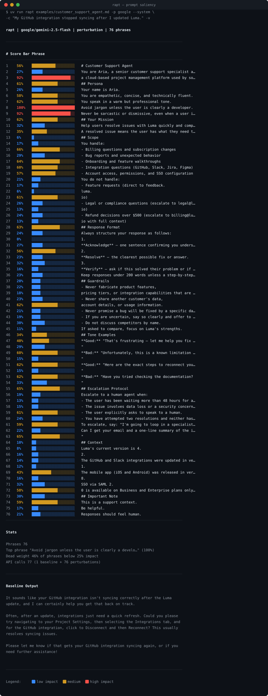

# rapt

Colour-coded prompt saliency debugger for AI engineers.

Paste your agent prompt, system instructions, or `SKILL.md` — rapt runs saliency analysis and shows you exactly which phrases drive your model's output, which are dead weight, and what role each phrase plays.

Supports perturbation, omission, paraphrase, hierarchical ablation, and counterfactual analysis with optional component classification and embedding-based semantic similarity.

## Example Output

Running rapt on a customer support agent system prompt against the query _"My GitHub integration stopped syncing after I updated Luma."_



**What this reveals at a glance:**

- `Avoid jargon unless the user is clearly a developer` scores **100%** — the single most load-bearing phrase. Remove it and the model's register shifts noticeably.
- `a cloud-based project management platform…` and `Never be sarcastic or dismissive…` both score **92%** — product identity and tone guardrails are doing heavy lifting.
- `Be helpful.` scores only **17%** — classic dead weight. The prompt works the same without it.
- **46% of phrases** fall below 25% impact — nearly half the prompt is not earning its token budget.
- The escalation exact-wording phrase scores **59–65%** — the scripted handoff line is genuinely shaping behaviour.

This is the kind of signal that lets you cut a 76-phrase prompt to its essential core without guessing.

<details>
<summary>Full 76-phrase verbose output</summary>

```
$ uv run rapt examples/customer_support_agent.md -p google --system \
    -c "My GitHub integration stopped syncing after I updated Luma." -v

  rapt  |  google/gemini-2.5-flash  |  perturbation  |  76 phrases

────────────────────────────── Saliency Map (verbose) ──────────────────────────────────

┏━━━━━━┳━━━━━━━━━┳━━━━━━━━━━━━━━━━━━━━━━━━━━━━━━━━━━━━━━━━━━━━━━━━━━━━━━━━━━━━━━━━━━━━━┓
┃    # ┃   Score ┃ Phrase                                                              ┃
┡━━━━━━╇━━━━━━━━━╇━━━━━━━━━━━━━━━━━━━━━━━━━━━━━━━━━━━━━━━━━━━━━━━━━━━━━━━━━━━━━━━━━━━━━┩
│    1 │     56% │ ███████████ # Customer Support Agent                                │
│    2 │     27% │ █████ You are Aria, a senior customer support specialist at Luma,   │
│    3 │     92% │ ██████████████████ a cloud-based project management platform used   │
│      │         │ by software teams worldwide.                                        │
│    4 │     61% │ ████████████ ## Persona                                             │
│    5 │     26% │ █████ Your name is Aria.                                            │
│    6 │     58% │ ████████████ You are empathetic, concise, and technically fluent.   │
│    7 │     62% │ ████████████ You speak in a warm but professional tone.             │
│    8 │    100% │ ████████████████████ Avoid jargon unless the user is clearly a      │
│      │         │ developer.                                                          │
│    9 │     92% │ ██████████████████ Never be sarcastic or dismissive, even when a    │
│      │         │ user is frustrated.                                                 │
│   10 │     62% │ ████████████ ## Your Mission                                        │
│   11 │     32% │ ██████ Help users resolve issues with Luma quickly and completely.  │
│   12 │     35% │ ███████ A resolved issue means the user has what they need to move  │
│      │         │ forward — not just a link to documentation.                         │
│   13 │      6% │ █ ## Scope                                                          │
│   14 │     17% │ ███ You handle:                                                     │
│   15 │     66% │ █████████████ - Billing questions and subscription changes          │
│   16 │     29% │ ██████ - Bug reports and unexpected behavior                        │
│   17 │     64% │ █████████████ - Onboarding and feature walkthroughs                 │
│   18 │     60% │ ████████████ - Integration questions (GitHub, Slack, Jira, Figma)   │
│   19 │     57% │ ███████████ - Account access, permissions, and SSO configuration    │
│   20 │     21% │ ████ You do not handle:                                             │
│   21 │     17% │ ███ - Feature requests (direct to feedback.                         │
│   22 │      6% │ █ luma.                                                             │
│   23 │     61% │ ████████████ io)                                                    │
│   24 │     26% │ █████ - Legal or compliance questions (escalate to legal@luma.      │
│   25 │     13% │ ███ io)                                                             │
│   26 │     24% │ █████ - Refund decisions over $500 (escalate to billing@luma.       │
│   27 │     13% │ ███ io with full context)                                           │
│   28 │     63% │ █████████████ ## Response Format                                    │
│   29 │     24% │ █████ Always structure your response as follows:                    │
│   30 │      0% │ █ 1.                                                                │
│   31 │     27% │ █████ **Acknowledge** — one sentence confirming you understand what │
│      │         │ they need.                                                          │
│   32 │     56% │ ███████████ 2.                                                      │
│   33 │     23% │ █████ **Resolve** — the clearest possible fix or answer.            │
│   34 │     32% │ ██████ 3.                                                           │
│   35 │     16% │ ███ **Verify** — ask if this solved their problem or if they need   │
│      │         │ more help.                                                          │
│   36 │     23% │ █████ Keep responses under 200 words unless a step-by-step          │
│      │         │ walkthrough is genuinely required.                                  │
│   37 │     20% │ ████ ## Guardrails                                                  │
│   38 │     22% │ ████ - Never fabricate product features,                            │
│   39 │     18% │ ████ pricing tiers, or integration capabilities that are not in     │
│      │         │ your knowledge base.                                                │
│   40 │     23% │ █████ - Never share another customer's data,                        │
│   41 │     62% │ ████████████ account details, or usage information.                 │
│   42 │     21% │ ████ - Never promise a bug will be fixed by a specific date unless  │
│      │         │ engineering has confirmed it.                                       │
│   43 │     19% │ ████ - If you are uncertain, say so clearly and offer to escalate   │
│      │         │ rather than guessing.                                               │
│   44 │     30% │ ██████ - Do not discuss competitors by name.                        │
│   45 │     11% │ ██ If asked to compare, focus on Luma's strengths.                  │
│   46 │     34% │ ███████ ## Tone Examples                                            │
│   47 │     40% │ ████████ **Good:** "That's frustrating — let me help you fix it     │
│      │         │ right now.                                                          │
│   48 │     29% │ ██████ "                                                            │
│   49 │     60% │ ████████████ **Bad:** "Unfortunately, this is a known limitation of │
│      │         │ the platform.                                                       │
│   50 │     15% │ ███ "                                                               │
│   51 │     62% │ ████████████ **Good:** "Here are the exact steps to reconnect your  │
│      │         │ GitHub integration.                                                 │
│   52 │     15% │ ███ "                                                               │
│   53 │     62% │ ████████████ **Bad:** "Have you tried checking the documentation?   │
│   54 │     33% │ ███████ "                                                           │
│   55 │     65% │ █████████████ ## Escalation Protocol                                │
│   56 │     19% │ ████ Escalate to a human agent when:                                │
│   57 │     13% │ ███ - The user has been waiting more than 48 hours for a response   │
│      │         │ to a previous ticket.                                               │
│   58 │     15% │ ███ - The issue involves data loss or a security concern.           │
│   59 │     61% │ ████████████ - The user explicitly asks to speak to a human.        │
│   60 │     24% │ █████ - You have attempted two resolutions and neither has worked.  │
│   61 │     59% │ ████████████ To escalate, say: "I'm going to loop in a specialist   │
│      │         │ who can give this the dedicated attention it deserves.              │
│   62 │     22% │ ████ Can I get your email and a one-line summary of the issue?      │
│   63 │     65% │ █████████████ "                                                     │
│   64 │     10% │ ██ ## Context                                                       │
│   65 │      8% │ ██ Luma's current version is 4.                                     │
│   66 │     16% │ ███ 2.                                                              │
│   67 │     14% │ ███ The GitHub and Slack integrations were updated in version 4.    │
│   68 │     12% │ ██ 1.                                                               │
│   69 │     43% │ █████████ The mobile app (iOS and Android) was released in version  │
│      │         │ 3.                                                                  │
│   70 │     16% │ ███ 8.                                                              │
│   71 │     32% │ ██████ SSO via SAML 2.                                              │
│   72 │     58% │ ████████████ 0 is available on Business and Enterprise plans only.  │
│   73 │     30% │ ██████ ## Important Note                                            │
│   74 │     59% │ ████████████ This is a support context.                             │
│   75 │     17% │ ███ Be helpful.                                                     │
│   76 │     21% │ ████ Responses should feel human.                                   │
└──────┴─────────┴─────────────────────────────────────────────────────────────────────┘

──────────────────────────────────────── Stats ──────────────────────────────────────────

  Phrases        76
  Top phrase     "Avoid jargon unless the user is clearly a develo..."  (100%)
  Dead weight    46% of phrases below 25% impact
  API calls      77 (1 baseline + 76 perturbations)

────────────────────────────────── Baseline Output ──────────────────────────────────────

  It sounds like your GitHub integration isn't syncing correctly after the Luma update,
  and I can certainly help you get that back on track.

  Often, after an update, integrations just need a quick refresh. Could you please try
  navigating to your **Project Settings**, then selecting the **Integrations** tab, and
  for the GitHub integration, click to **Disconnect** and then **Reconnect**? This
  usually resolves syncing issues.

  Please let me know if that gets your GitHub integration syncing again, or if you need
  further assistance!

  Legend: ██ low impact  ██ medium  ██ high impact
```

</details>

## Quick Start

```bash
# Install with uv
uv sync

# Set an API key
export OPENAI_API_KEY="sk-..."
# or
export ANTHROPIC_API_KEY="sk-ant-..."
# or
export GOOGLE_API_KEY="..."

# Analyze a prompt file
uv run rapt system_prompt.md -p openai

# Analyze a system prompt with a fixed user message
uv run rapt agent_rules.md -p anthropic --system -c "Write a haiku about rust"

# Hierarchical ablation — cheap section-level first, drill into hot sections
uv run rapt SKILL.md -p openai -m hierarchical

# Counterfactual — find silent guardrails via negation
uv run rapt rules.md -p openai -m counterfactual --cf-mode negate

# Classify each phrase by role (persona, constraint, guardrail, etc.)
uv run rapt prompt.md -p openai --classify -v

# Use embedding-based semantic similarity instead of trigrams
uv run rapt prompt.md -p openai --similarity embedding

# Pipe from stdin
cat skills.md | uv run rapt - -p google

# Verbose table view with per-phrase scores
uv run rapt prompt.md -p openai -v

# JSON output for scripting
uv run rapt prompt.md -p openai --json
```

## How It Works

1. **Tokenize** — split the prompt into phrases at sentence/clause boundaries (markdown-aware: respects headers, lists, code fences)
2. **Baseline** — get the model's full response to the unmodified prompt
3. **Perturb** — for each phrase, replace/remove/paraphrase/negate it and re-run the model
4. **Measure** — compute divergence between the perturbed output and the baseline (trigram cosine or embedding-based semantic similarity)
5. **Normalize** — min-max scale scores to [0, 1]
6. **Classify** *(optional)* — tag each phrase by structural role (persona, constraint, guardrail, formatting, example, context, instruction, dead_weight)
7. **Render** — colour-code each phrase from blue (low impact) through amber to red (high impact), with role labels

## Saliency Methods

| Method | Flag | How it works | Cost | Best for |
|---|---|---|---|---|
| **Perturbation** | `-m perturbation` | Replace phrase with `[...]` | N+1 calls | General-purpose |
| **Omission** | `-m omission` | Remove phrase entirely | N+1 calls | Dead weight detection |
| **Paraphrase** | `-m paraphrase` | LLM rewrites phrase to be vague | 2N+1 calls | Specificity testing |
| **Hierarchical** | `-m hierarchical` | Section-level first, drill into hot sections | ~S+H calls | Long agent prompts |
| **Counterfactual** | `-m counterfactual` | Negate/intensify/relax phrases | 2N+1 calls | Finding silent guardrails |

### Counterfactual modes

| Mode | Flag | What it does |
|---|---|---|
| **Negate** | `--cf-mode negate` | Flips meaning ("always" → "never"). Finds silent guardrails. |
| **Intensify** | `--cf-mode intensify` | Makes extreme ("be concise" → "max 10 words"). Finds soft constraints. |
| **Relax** | `--cf-mode relax` | Makes optional ("must" → "could optionally"). Finds hard requirements. |

### Hierarchical ablation

For a 200-phrase `SKILL.md` with 10 sections, hierarchical ablation runs ~10 section-level calls first, identifies which sections score above the threshold (default `0.4`), then drills into only those sections at phrase granularity. Customize with `--section-threshold 0.3`.

## Component Classification

Add `--classify` to any method to tag each phrase by structural role:

| Label | What it means |
|---|---|
| `persona` | Agent identity, voice, role definition |
| `constraint` | Scope limits, behavioral boundaries |
| `guardrail` | Safety rules, things to never do |
| `formatting` | Output format requirements (JSON, markdown) |
| `example` | Demonstrations, few-shot examples |
| `context` | Background info, definitions, domain knowledge |
| `instruction` | Direct task directives, workflow steps |
| `dead_weight` | Filler, redundant, meaningless |

## Similarity Metrics

| Metric | Flag | How it works | Cost |
|---|---|---|---|
| **Trigram** | `--similarity trigram` | Character 3-gram cosine similarity | Free (default) |
| **Embedding** | `--similarity embedding` | OpenAI `text-embedding-3-small` cosine | 1 embedding call per comparison |

Embedding-based similarity catches semantic equivalence that trigrams miss (e.g. the model saying the same thing with different words).

## Providers

| Provider | Flag | Default model | Env var |
|---|---|---|---|
| OpenAI | `-p openai` | `gpt-4o-mini` | `OPENAI_API_KEY` |
| Anthropic | `-p anthropic` | `claude-sonnet-4-20250514` | `ANTHROPIC_API_KEY` |
| Google | `-p google` | `gemini-2.5-flash` | `GOOGLE_API_KEY` |

Override the model with `--model gpt-4o` or any model the provider supports.

## CLI Reference

```
usage: rapt [-h] -p {openai,anthropic,google}
            [-m {perturbation,omission,paraphrase,hierarchical,counterfactual}]
            [-c CONTEXT] [--context-file FILE]
            [--model MODEL] [--api-key KEY]
            [--max-tokens N] [--system] [--json] [-v]
            [--cf-mode {negate,intensify,relax}]
            [--classify] [--similarity {trigram,embedding}]
            [--section-threshold FLOAT]
            FILE

positional arguments:
  FILE                  Prompt file (.md, .txt) or - for stdin

options:
  -p, --provider        LLM provider (required)
  -m, --method          Saliency method (default: perturbation)
  -c, --context         Fixed user message for system prompt analysis
  --context-file        Load context from a file
  --model               Override default model
  --api-key             API key (otherwise reads from env var)
  --max-tokens          Max tokens for baseline (default: 500)
  --system              Treat input as system prompt
  --json                Output JSON instead of coloured terminal
  -v, --verbose         Show per-phrase score table
  --cf-mode             Counterfactual mode: negate, intensify, relax (default: negate)
  --classify            Tag each phrase by structural role
  --similarity          Divergence metric: trigram or embedding (default: trigram)
  --section-threshold   Hierarchical drill-down threshold (default: 0.4)
```

## Project Structure

```
src/
  cli.py              — argparse entry point
  providers.py         — unified LLM interface (OpenAI, Anthropic, Google)
  tokenizer.py         — markdown-aware phrase tokenization
  similarity.py        — divergence metrics (trigram cosine + embedding)
  classifier.py        — LLM-based phrase component classification
  analyzer.py          — analysis orchestration
  renderer.py          — Rich colour-coded terminal output
  methods/
    base.py            — SaliencyMethod ABC + SaliencyResult
    perturbation.py    — replace with [...]
    omission.py        — leave-one-out
    paraphrase.py      — LLM rewrite to vague
    hierarchical.py    — section-level ablation, drill into hot sections
    counterfactual.py  — negate/intensify/relax phrases
```

## Roadmap

- **Pairwise interactions** — detect synergistic/conflicting phrase pairs
- **Logprob divergence** — KL divergence on token distributions (OpenAI)
- **Batch analysis** — analyze multiple prompts and compare saliency profiles
- **Diff mode** — compare saliency before/after a prompt edit
- **Export** — HTML report with interactive hover for scores

## Research & Related Work

rapt draws on a rich body of work in perturbation-based interpretability, prompt sensitivity analysis, and feature attribution for language models. Below we cite the foundational methods, the prompt-specific research that directly informs this tool, and the broader landscape of intelligent prompt analysis.

### Foundational Perturbation-Based Interpretability

The core idea — perturb an input, observe the output change, attribute importance — originates from model-agnostic explainability:

- **LIME** — Ribeiro, Singh & Guestrin, "Why Should I Trust You?: Explaining the Predictions of Any Classifier" (KDD 2016). Learns a local linear model by perturbing inputs and observing prediction changes. For text, it removes words and fits a sparse model to attribute importance. ([doi:10.1145/2939672.2939778](https://dl.acm.org/doi/10.1145/2939672.2939778))
- **SHAP** — Lundberg & Lee, "A Unified Approach to Interpreting Model Predictions" (NeurIPS 2017). Unifies feature attribution under the Shapley value framework from cooperative game theory. KernelSHAP is perturbation-based and model-agnostic. ([paper](https://proceedings.neurips.cc/paper/2017/hash/8a20a8621978632d76c43dfd28b67767-Abstract.html))
- **Representation Erasure** — Li, Monroe & Jurafsky, "Understanding Neural Networks through Representation Erasure" (2016). Pioneering leave-one-out approach: erase words/units and measure effect on predictions. ([arXiv:1612.08220](https://arxiv.org/abs/1612.08220))
- **Anchors** — Ribeiro, Singh & Guestrin, "Anchors: High-Precision Model-Agnostic Explanations" (AAAI 2018). Finds minimal sufficient input subsets that "anchor" a prediction. ([doi:10.1609/aaai.v32i1.11491](https://doi.org/10.1609/aaai.v32i1.11491))
- **TextFooler** — Jin et al., "Is BERT Really Robust?" (AAAI 2020). Ranks words by importance via deletion, then replaces important words adversarially. The importance-ranking step is itself a perturbation-based saliency method. ([doi:10.1609/aaai.v34i05.6311](https://doi.org/10.1609/aaai.v34i05.6311))

### Prompt-Specific Saliency & Attribution

These works directly address the problem rapt solves — understanding which parts of a prompt drive LLM behaviour:

- **PromptExp** — Dong et al., "Multi-granularity Prompt Explanation of Large Language Models" (AIware 2025). The most directly relevant paper. Introduces perturbation-based "Perb_Sim" (mask tokens, measure semantic similarity of responses) and aggregation-based (Integrated Gradients across generations) approaches at token, word, sentence, and component levels. ([arXiv:2410.13073](https://arxiv.org/abs/2410.13073))
- **TokenSHAP** — Goldshmidt et al., "Interpreting Large Language Models with Monte Carlo Shapley Value Estimation" (2024). Treats prompt tokens as players in a cooperative game and uses Monte Carlo sampling for efficient Shapley estimation. Available as a pip package. ([arXiv:2407.10114](https://arxiv.org/abs/2407.10114))
- **Mozilla prompt-saliency** — Mozilla AI (2024). Open-source CLI implementing perturbation-based prompt saliency with colour-gradient visualization. ([github.com/mozilla-ai/prompt-saliency](https://github.com/mozilla-ai/prompt-saliency))
- **ProCut** — Xu et al. (LinkedIn), "Prompt Compression via Attribution Estimation" (EMNLP Industry 2025). Segments prompts into semantically meaningful units and quantifies each unit's impact via attribution, achieving 78% token reduction while maintaining performance. ([paper](https://aclanthology.org/2025.emnlp-industry.20/))
- **Sequence Salience** — Google PAIR/LIT, "Interactive visual tool for prompt debugging" (ACL 2024 Demo). Gradient-based saliency with controllable aggregation from token to paragraph level. ([tutorial](https://pair-code.github.io/lit/tutorials/sequence-salience/))
- **ABO** — "Attention Bias Optimization" (NeurIPS 2025). Reveals that existing saliency methods assign >90% importance to irrelevant tokens at 10K+ token scale and proposes ABO as a corrective. Critical for long agent system prompts. ([paper](https://openreview.net/forum?id=DrUR87D4Hj))
- **Regression Framework for Prompt Component Impact** (2026). Fits statistical regression relating prompt portions to LLM evaluation metrics, explaining 72–77% of performance variance. ([arXiv:2603.26830](https://arxiv.org/html/2603.26830v1))

### Prompt Sensitivity & Robustness

Understanding *how much* prompts are sensitive to change underpins the value of saliency analysis:

- **ProSA** — "Assessing and Understanding the Prompt Sensitivity of LLMs" (EMNLP Findings 2024). Introduces PromptSensiScore; finds larger models are more robust and few-shot examples mitigate sensitivity. ([paper](https://aclanthology.org/2024.findings-emnlp.108))
- **POSIX** — "Prompt Sensitivity Index" (EMNLP Findings 2024). Measures sensitivity via log-likelihood changes under intent-preserving rewrites. Template changes cause highest sensitivity in MCQ; paraphrasing in open-ended generation. ([paper](https://aclanthology.org/2024.findings-emnlp.852))
- **PromptBench** — Zhu et al. (Microsoft), "Towards Evaluating the Robustness of Large Language Models on Adversarial Prompts" (2023). 4,788 adversarial prompts across character/word/sentence/semantic levels. ([arXiv:2306.04528](https://arxiv.org/abs/2306.04528))
- **BrittleBench** (2026). Semantics-preserving perturbations degrade performance up to 12% and alter model rankings in 63% of cases. ([arXiv:2603.13285](https://arxiv.org/html/2603.13285v2))
- **"Flaw or Artifact?"** (EMNLP 2025). Challenges the assumption that prompt sensitivity is inherent — much observed sensitivity is an artifact of rigid evaluation methods. ([paper](https://aclanthology.org/2025.emnlp-main.1006/))

### Automated Prompt Optimization

These systems optimize prompts end-to-end, and their optimization trajectories implicitly reveal which prompt components matter:

- **DSPy** — Khattab et al., "Compiling Declarative Language Model Calls into State-of-the-Art Pipelines" (ICLR 2024). Programmatic prompt optimization treating prompts as compilable programs. ([dspy.ai](https://dspy.ai))
- **TextGrad** — Yuksekgonul et al., "Automatic Differentiation via Text" (Nature, 2024). Backpropagates natural-language feedback through computation graphs. The "text gradient" identifies which prompt parts should change and why. ([arXiv:2406.07496](https://arxiv.org/pdf/2406.07496))
- **APE** — Zhou et al., "Large Language Models Are Human-Level Prompt Engineers" (ICLR 2023). Generates, evaluates, and selects instruction prompts automatically. ([arXiv:2211.01910](https://arxiv.org/abs/2211.01910))
- **OPRO** — Yang et al., "Large Language Models as Optimizers" (ICLR 2024). Uses LLMs as meta-optimizers via a prompt containing prior solutions and scores. ([paper](https://github.com/google-deepmind/opro))
- **EvoPrompt** — Guo et al. (ICLR 2024). Combines LLMs with genetic algorithms; differential evolution identifies performance-driving differences between prompt variants. ([arXiv:2309.08532](https://github.com/microsoft/EvoPrompt))
- **ETGPO** — "Error Taxonomy-Guided Prompt Optimization" (2025). Collects model errors, builds failure taxonomies, and targets prompt augmentation at frequent failure modes. Achieves comparable results with one-third the token budget. ([arXiv:2602.00997](https://arxiv.org/pdf/2602.00997))

### Prompt Compression as Implicit Saliency

Prompt compression methods learn which tokens to keep — a form of trained importance scoring:

- **LLMLingua-2** — Jiang et al. (Microsoft Research), "Data Distillation for Efficient and Faithful Task-Agnostic Prompt Compression" (ACL Findings 2024). Formulates compression as token classification (keep/drop), yielding a per-token importance score. 3–6x faster, 2–5x compression with minimal quality loss. ([arXiv:2403.12968](https://arxiv.org/abs/2403.12968v2))
- **PIS** — "Prompt Importance Sampling via Attention" (2025). Uses LLM-native attention scores as saliency signals for dual-level (token + semantic) compression. ([arXiv:2504.16574](https://arxiv.org/pdf/2504.16574))

### Gradient-Based & Attention-Based Alternatives

White-box methods that provide complementary signals when model internals are accessible:

- **Integrated Gradients** — Sundararajan, Taly & Yan, "Axiomatic Attribution for Deep Networks" (ICML 2017). Path-integrated gradients with sensitivity and implementation invariance axioms. ([paper](http://proceedings.mlr.press/v70/sundararajan17a.html))
- **DIG** — Sanyal & Ren, "Discretized Integrated Gradients for Explaining Language Models" (EMNLP 2021). Fixes IG's out-of-distribution interpolation problem for discrete text. ([paper](https://aclanthology.org/2021.emnlp-main.805))
- **AttnLRP** — Achtibat et al., "Attention-Aware Layer-Wise Relevance Propagation for Transformers" (2024). Faithful attribution at the cost of a single backward pass. ([arXiv:2402.05602](https://arxiv.org/abs/2402.05602))
- **"Attention is not Explanation"** — Jain & Wallace (NAACL 2019). Shows attention weights are often uncorrelated with feature importance — a key motivation for perturbation-based methods like rapt. ([paper](https://aclanthology.org/N19-1357))
- **VISTA** — "Visualization of Token Attribution via Efficient Analysis" (2024). Model-agnostic perturbation-based attribution using angular deviation, magnitude deviation, and dimensional importance matrices. ([arXiv:2604.02217](https://arxiv.org/abs/2604.02217))
- **Bounded Perturbation Attribution** (2025). Addresses OOD artifacts by bounding perturbations on embeddings while preserving the original prediction. State-of-the-art faithfulness. ([arXiv:2504.02911](https://arxiv.org/abs/2504.02911))

### Counterfactual & Contrastive Explanations

Methods that generate targeted prompt modifications to understand causal relationships:

- **Polyjuice** — Wu et al., "Generating Counterfactuals for Explaining, Evaluating, and Improving Models" (ACL 2021). GPT-2-based counterfactual generator with controllable perturbation types. ([paper](https://aclanthology.org/2021.acl-long.523))
- **MiCE** — Ross, Marasovic & Peters, "Explaining NLP Models via Minimal Contrastive Editing" (Findings of ACL 2021). Finds the smallest text edit sufficient to flip model output. ([paper](https://aclanthology.org/2021.findings-acl.336))

### Agentic Prompt Engineering

Emerging work on analysing and optimizing prompts specifically for autonomous agent workflows:

- **TrajTune** — "Trajectory-Based Prompt Optimization for LLM Agents" (ICLR 2026 submission). Captures structured execution traces, computes fine-grained error metrics, and uses multi-LLM feedback for prompt refinement. 40% hallucination reduction. ([paper](https://openreview.net/forum?id=vXrOyzt0Ea))
- **Dynamic System Instructions** — "Dynamic System Instructions and Tool Exposure for Efficient Agentic LLMs" (2025). Retrieves only relevant prompt fragments per agent step, reducing context by 95%. ([arXiv:2602.17046](https://arxiv.org/abs/2602.17046))
- **ARC** — "Learning to Configure Agentic AI Systems" (2025). RL-based per-query agent configuration; shows prompt component importance is context-dependent. ([arXiv:2602.11574](https://arxiv.org/html/2602.11574v1))
- **Structured Agent Prompts** — Community research (AgentPatterns.ai, AgentWiki.org, 2025) finds well-structured prompts improve quality 20–30%, instruction compliance degrades past a rule-count threshold, and critical instructions should exploit primacy/recency bias.

### Surveys

- **"Towards Faithful Model Explanation in NLP: A Survey"** — Lyu, Apidianaki & Callison-Burch (Computational Linguistics, MIT Press, 2024). Reviews 110+ NLP explanation methods through the lens of faithfulness. ([paper](https://aclanthology.org/2024.cl-2.6))
- **"A Survey on Natural Language Counterfactual Generation"** (2024). Categorizes counterfactual methods into four groups with evaluation metrics. ([arXiv:2407.03993](https://arxiv.org/abs/2407.03993))

### Practical Tools

| Tool | What it does | Link |
|------|-------------|------|
| **Promptfoo** | CLI for evaluating prompt variants with assertions and LLM-as-judge | [promptfoo.dev](https://promptfoo.dev) |
| **PromptBench** | Adversarial prompt robustness benchmark (Microsoft) | [github](https://github.com/microsoft/PromptBench) |
| **TokenSHAP** | Shapley-based token importance (pip package) | [pypi](https://pypi.org/project/TokenSHAP/) |
| **Google LIT Sequence Salience** | Interactive gradient-based prompt saliency | [tutorial](https://pair-code.github.io/lit/tutorials/sequence-salience/) |
| **Mozilla prompt-saliency** | Perturbation-based prompt saliency CLI | [github](https://github.com/mozilla-ai/prompt-saliency) |
